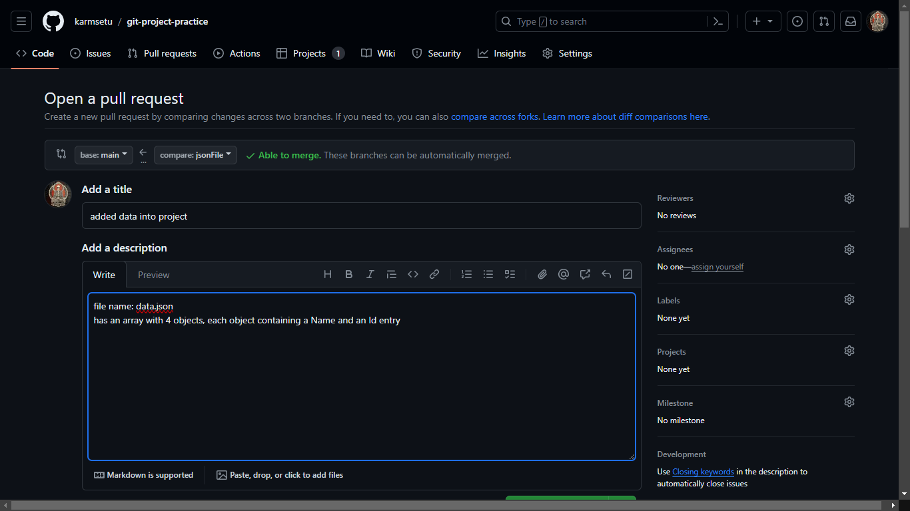
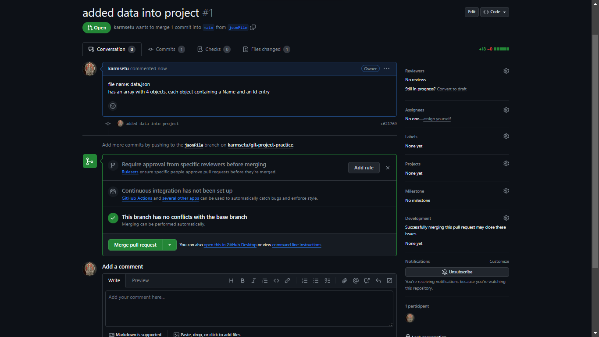

# git-project-practice

this is a testing/practice repository for working in project with git

## Branching

```bash
git checkout -b <branchName>
```

### how to know current branch

```bash
git branch
```

### delete branch

```bash
git branch -D <fileName>
```

## Adding

```bash
git add <fileName> or .
```

## commit

```bash
git commit -m "<message>"
```

-   saves snapshot locally

## push

```bash
git push -u origin <branchName>
```

## pull

```bash
git pull origin main
```

-   pull from the main/ merged directory
    `git pull`

## GitHub UI merge

-   from sender
    
-   From inspector
    

## Going back

1. One commit

```
git reset HEAD~1
```

2. multiple commit

```
git reset <commitHash>
```

-   for changes in UI

```
git reset --hard <commitHash>
```

## difference

```bash
git diff
```

# create a branch on remote /github

```bash
git push --set-upstream <fileName>
```

# file removal

```bash
git rm PROJECTS.md
```

# git log

```
git log
```

> press `q` to quit

| Option          | Description                                                                                                                              |
| --------------- | ---------------------------------------------------------------------------------------------------------------------------------------- |
| -p              | Show the patch introduced with each commit.                                                                                              |
| --stat          | Show statistics for files modified in each commit.                                                                                       |
| --shortstat     | Display only the changed/insertions/deletions line from the --stat command.                                                              |
| --name-only     | Show the list of files modified after the commit information.                                                                            |
| --name-status   | Show the list of files affected with added/modified/deleted information as well.                                                         |
| --abbrev-commit | Show only the first few characters of the SHA-1 checksum instead of all 40.                                                              |
| --relative-date | Display the date in a relative format (for example, “2 weeks ago”) instead of using the full date format.                                |
| --graph         | Display an ASCII graph of the branch and merge history beside the log output.                                                            |
| --pretty        | Show commits in an alternate format. Option values include oneline, short, full, fuller, and format (where you specify your own format). |
| --oneline       | Shorthand for --pretty=oneline --abbrev-commit used together                                                                             |
